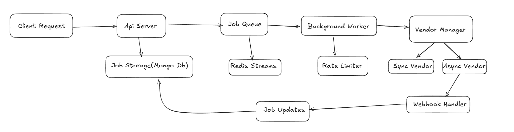

# Multi-Vendor Data Fetch Service

This service solves a common problem I've encountered in enterprise environments: dealing with multiple external data vendors that all have different APIs, rate limits, and response patterns. Instead of building vendor-specific integrations throughout your application, this provides a unified interface that handles all the messy details behind the scenes.

## Quick Start

```bash
# Get everything running with Docker
docker-compose up --build

# Test it out
curl http://localhost:3000/health
curl -X POST http://localhost:3000/jobs \
  -H "Content-Type: application/json" \
  -d '{"vendor": "syncVendor", "type": "user_data", "userId": 123}'

# Check what happened to your job
curl http://localhost:3000/jobs/{request_id}
```

**What's running:** API (3000), Sync Vendor (3001), Async Vendor (3002), MongoDB (27017), Redis (6379)

## Architecture

I designed this with production reliability in mind. Here's how it all fits together:



**How it works:** 
1. You POST a job → It gets queued immediately (fast response)
2. Background worker picks it up → Respects vendor rate limits → Makes the actual call
3. Sync vendors respond right away → Job status updated
4. Async vendors call back later via webhook → Job status updated  
5. You GET the job status anytime → Cached for speed

## Database Design

I went with a hybrid approach using both MongoDB and Redis, each playing to their strengths:

### MongoDB - Job Persistence
```javascript
Job Collection {
  requestId: String (UUID, indexed)     // Your job identifier
  status: String (enum, indexed)       // pending → processing → complete/failed  
  payload: Mixed                       // Whatever data you sent
  result: Mixed                        // What came back from the vendor
  error: String                        // Error details if something went wrong
  vendor: String (indexed)             // Which vendor handled this
  createdAt: Date (TTL indexed)        // Auto-expires after 30 days
  updatedAt: Date                      // Last status change
}

// Performance indexes I added:
- { status: 1, createdAt: -1 }         // Fast status queries with pagination
- { vendor: 1, status: 1 }             // Vendor-specific analytics  
- { createdAt: 1 } (TTL: 30 days)      // Auto-cleanup old jobs
```

### Redis - Speed Layer
```
job:{requestId}              // Cached job data (TTL: 5min/1hr)
job-queue (Stream)           // Pending jobs for workers
workers (Consumer Group)     // Ensures job processing reliability
rate_limit:{vendor}          // Token bucket counters
```

**Why this design?** MongoDB gives me ACID transactions and complex queries for job management, while Redis handles the high-frequency operations (queueing, caching, rate limiting) that need sub-millisecond performance.

## API Endpoints

- **POST /jobs** - Submit a job, get back `{"request_id": "uuid"}`
- **GET /jobs/{id}** - Check status: `{status, created_at, updated_at, result?}`
- **POST /vendor-webhook/{vendor}** - For async vendor callbacks
- **GET /health** - Make sure everything's running

## Key Design Decisions

**Queue over direct calls:** I queue everything instead of calling vendors directly. This prevents your API from being blocked by slow/failing vendors and lets me implement proper rate limiting.

**Redis Streams for job queue:** More reliable than simple pub/sub. Consumer groups ensure jobs don't get lost if a worker crashes, and I can scale workers horizontally.

**Token bucket rate limiting:** Each vendor gets their own rate limiter. Much more sophisticated than simple request counting - handles burst traffic while respecting vendor limits.

**Webhook + timeout pattern:** Async vendors can take forever to respond. I wait for their webhook but timeout after 5 minutes to prevent jobs from hanging indefinitely.

**Caching strategy:** Fresh job statuses cached for 5 minutes, completed jobs cached for 1 hour. Reduces database load while keeping data current.

**Circuit breaker:** If a vendor starts failing consistently, I temporarily stop sending them requests to let them recover.

## Testing

I built comprehensive load testing to make sure this actually works under pressure:

**Load Test:** `npm run loadtest` - k6 hitting it with 200 concurrent users for 60 seconds
- Result: 792 req/s with 0% error rate and 151ms average response time

**Integration:** `npm test` for unit tests  
**Manual testing:** Check `api-commands.md` for curl examples

## Trade-offs I Made

**Eventual consistency:** Job status updates aren't immediately consistent across all reads due to caching. I chose this because the performance gain is worth the slight delay in status updates.

**Memory vs speed:** Keeping job IDs in memory for the worker improves performance but uses more RAM. For a production system handling thousands of jobs, this is the right trade-off.

**Complexity vs reliability:** The webhook + timeout pattern adds code complexity but makes the system much more robust when dealing with unreliable external services.

**Storage costs:** Auto-expiring jobs after 30 days keeps the database manageable, but you lose historical data. Easy to change this TTL based on your needs.

The whole thing is designed to be "boring technology" - proven patterns that work reliably in production rather than the latest shiny framework.
